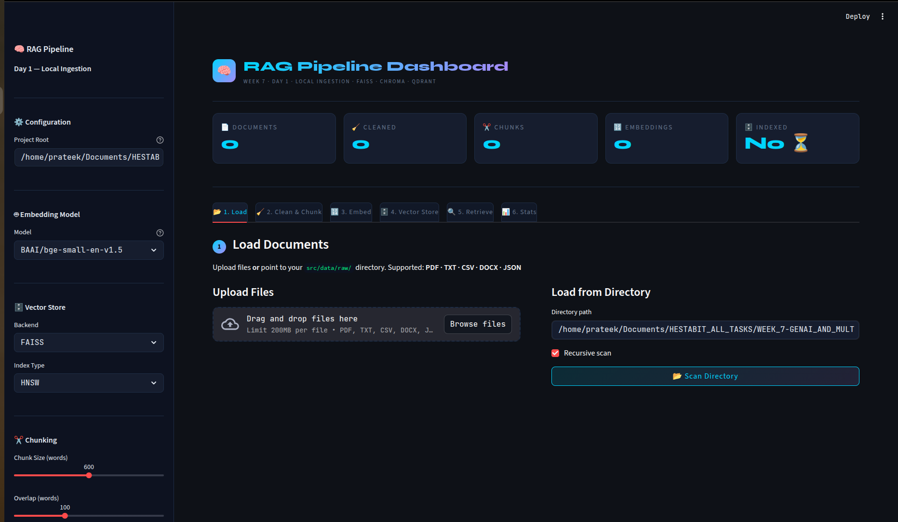
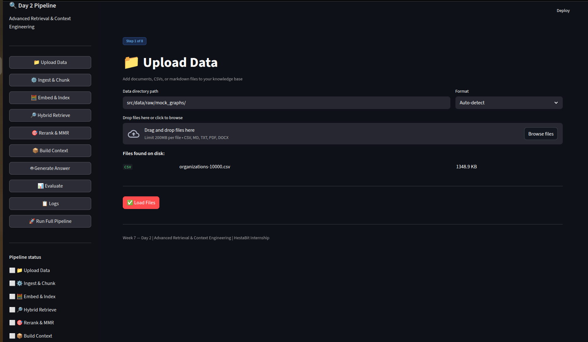
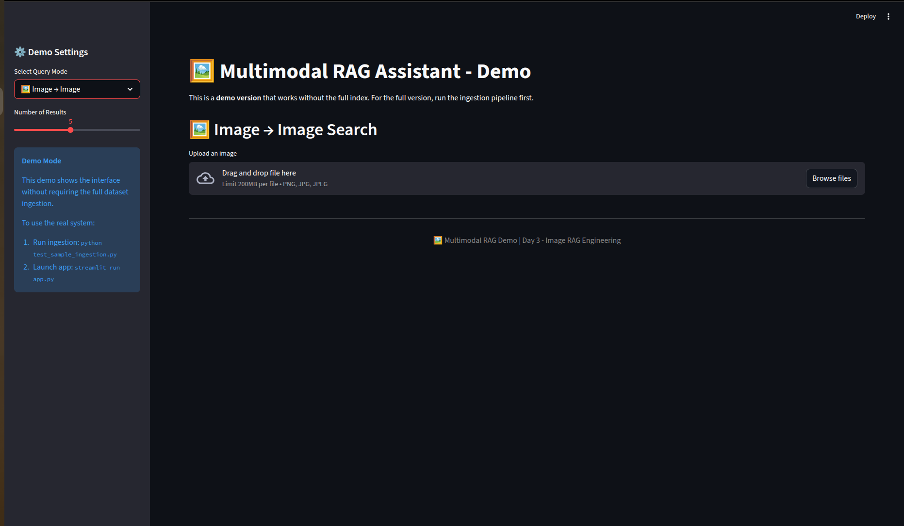

# Week 7 — GenAI & Multimodal RAG Engineering

> **Enterprise Knowledge Intelligence System** — A production-grade GenAI pipeline supporting Text RAG, Image RAG, SQL Question Answering, Hybrid Retrieval, and Local/Hosted LLMs.

---

## 📌 Overview

This project simulates a real-world enterprise GenAI system capable of:

- Answering questions from internal documents (PDFs, DOCX, TXT)
- Retrieving and reasoning over images (diagrams, charts, forms)
- Querying structured data using natural language → SQL → result
- Running on local open-source models **or** hosted LLM APIs (OpenAI / Claude / Gemini)
- Providing faithful, non-hallucinated responses with evaluation & monitoring

### Real-World Use Cases
| Industry | Documents | Images | SQL |
|---|---|---|---|
| Banking | Policy manuals | Scanned KYC files | Transaction DB |
| Insurance | Claims PDFs | Damage images | Claims tables |
| Manufacturing | Manuals | Blueprints | Operational DB |

---

## 🗂️ Repository Structure

```
WEEK_7-GENAI_AND_MULTIMODAL_RAG_ENGINEERING/
├── DAY_1-LOCAL_RAG_SYSTEM/
├── DAY_2-ADVANCED_RETRIEVAL_AND_CONTEXT_ENGINEERING/
├── DAY_3-IMAGE_RAG_MULTIMODAL/
├── DAY_4-SQL_QA_SYSTEM/
└── DAY_5-ADVANCED_RAG_CAPSTONE/
```

Each day folder follows this standard structure:

```
DAY_X/
├── src/
│   ├── config/          # YAML configuration files
│   ├── data/            # raw, cleaned, chunks, embeddings
│   ├── embeddings/      # embedding generation modules
│   ├── evaluation/      # evaluation and scoring
│   ├── generator/       # LLM response generation
│   ├── memory/          # conversational memory (Day 5)
│   ├── models/          # model loaders
│   ├── pipelines/       # ingestion and processing pipelines
│   ├── prompts/         # prompt templates
│   ├── retriever/       # retrieval engines
│   ├── utils/           # shared utilities
│   └── vectorstore/     # FAISS index and metadata
├── docs/                # architecture and strategy documentation
├── logs/                # runtime logs
├── requirements.txt
└── README.md
```

---

## 📅 Day-by-Day Breakdown

### Day 1 — Local RAG System + Pipeline Architecture

**Goal:** Build a complete local document ingestion and retrieval pipeline.

**Key Files:**
| File | Description |
|---|---|
| `src/pipelines/ingest.py` | Loads PDF, TXT, CSV, DOCX → cleans → chunks (500–800 tokens) |
| `src/embeddings/embedder.py` | Generates local dense embeddings using BGE/GTE models |
| `src/vectorstore/index.faiss` | FAISS vector index storing document embeddings |
| `src/retriever/query_engine.py` | Semantic query engine over FAISS index |
| `docs/THEORY.md` | RAG architecture documentation |

**Deliverables Checklist:**
- [x] Documents loaded (PDF / TXT / CSV / DOCX)
- [x] Chunks created with metadata (source, page, tags)
- [x] Embeddings generated locally (no API required)
- [x] FAISS vector DB initialized

---

### Day 2 — Advanced Retrieval + Context Engineering

**Goal:** Improve retrieval accuracy with hybrid search, reranking, and context optimization.

**Key Files:**
| File | Description |
|---|---|
| `src/retriever/hybrid_retriever.py` | BM25 keyword + semantic vector hybrid search |
| `src/retriever/reranker.py` | Cross-encoder reranker with MMR deduplication |
| `src/pipelines/context_builder.py` | Assembles ranked chunks into optimized LLM context |
| `RETRIEVAL-STRATEGIES.md` | Hybrid retrieval architecture documentation |

**Features:**
```python
query  = "Explain how credit underwriting works"
top_k  = 5
filters = { "year": "2024", "type": "policy" }
```
- Keyword fallback when semantic confidence is low
- Cross-encoder reranking for precision
- Max Marginal Relevance (MMR) for diverse results
- Chunk deduplication and traceable context sources

**Deliverables Checklist:**
- [x] Hybrid retriever (BM25 + embeddings)
- [x] Reranker module
- [x] Context builder with token limit awareness
- [x] Retrieval strategies documented

---

### Day 3 — Image RAG (Multimodal RAG)

**Goal:** Extend RAG to handle images using CLIP embeddings, OCR, and BLIP captioning.

**Key Files:**
| File | Description |
|---|---|
| `src/pipelines/image_ingest.py` | Ingests PNG, JPG, scanned PDFs → OCR + caption + embed |
| `src/embeddings/clip_embedder.py` | CLIP vision + text embeddings for cross-modal search |
| `src/retriever/image_search.py` | Multimodal search engine (Text→Image, Image→Image, Image→Text) |
| `docs/MULTIMODAL-RAG.md` | Multimodal RAG architecture documentation |

**Query Modes:**
```
Text  → Image   : "Show me a diagram of a neural network"
Image → Image   : Upload diagram → find similar diagrams
Image → Text    : Upload chart   → get text explanation
```

**Pipeline:**
```
Image Input → OCR (Tesseract) → Caption (BLIP) → CLIP Embedding → FAISS Index → Search
```

**Deliverables Checklist:**
- [x] Image ingestion pipeline (PNG / JPG / scanned PDF)
- [x] CLIP embedder for vision + text alignment
- [x] Multimodal image search engine
- [x] Multimodal RAG documented

---

### Day 4 — SQL Question Answering System

**Goal:** Convert natural language queries into SQL, execute safely, and summarize results.

**Key Files:**
| File | Description |
|---|---|
| `src/pipelines/sql_pipeline.py` | End-to-end Text → SQL → Answer orchestration |
| `src/generator/sql_generator.py` | LLM-based schema-aware SQL generation |
| `src/utils/schema_loader.py` | Auto schema extractor for SQLite/PostgreSQL |
| `docs/SQL-QA-DOC.md` | SQL QA system documentation |

**Example Flow:**
```
User:   "Show total sales by region for 2024"
SQL:    SELECT region, SUM(sales) FROM transactions WHERE year=2024 GROUP BY region
Result: Table → Human-readable summary
```

**Features:**
- Auto schema loader (no manual table description needed)
- SQL validation before execution
- Injection-safe parameterized queries
- Error correction loop for invalid SQL
- Result summarization via LLM

**Deliverables Checklist:**
- [x] SQL pipeline (Text → SQL → Answer)
- [x] Schema-aware SQL generator
- [x] Auto schema loader
- [x] SQL QA documented

---

### Day 5 — Advanced RAG + Memory + Evaluation (Capstone)

**Goal:** Integrate all systems into a production-ready API with memory, evaluation, and hallucination detection.

**Key Files:**
| File | Description |
|---|---|
| `src/deployment/app.py` | FastAPI app with `/ask`, `/ask-image`, `/ask-sql` endpoints |
| `src/evaluation/rag_eval.py` | Faithfulness scoring + hallucination detection |
| `src/memory/memory_store.py` | Conversational memory (last 5 messages) |
| `data/chat_logs/CHAT-LOGS.json` | Sample chat logs with confidence scores |
| `DEPLOYMENT-NOTES.md` | Setup and deployment instructions |

**API Endpoints:**
```
POST /ask        → Document RAG query
POST /ask-image  → Multimodal image query
POST /ask-sql    → Natural language to SQL query
```

**System Features:**
```
✔ Memory for last 5 messages (Vector / Redis / Local File)
✔ Self-reflection refinement loop
✔ Hallucination detection
✔ Faithfulness + confidence scoring
✔ Logging and debugging traces
✔ Streamlit UI
```

**Deliverables Checklist:**
- [x] Production FastAPI application
- [x] RAG evaluator (faithfulness + hallucination)
- [x] Conversational memory store
- [x] Chat logs with evaluation scores
- [x] Deployment notes

---

## 🧠 Model Stack

### Path A — Open-Source Local (Fully Offline)
| Component | Options |
|---|---|
| LLM | Mistral-7B Instruct, LLaMA-3, Qwen2, Phi-3 |
| Embeddings | BGE-small, BGE-base, GTE-base, Instructor-XL |
| Vision | CLIP (image embeddings), BLIP (captioning) |
| OCR | Tesseract, OpenCV |
| Vector DB | FAISS, Chroma, Qdrant |
| SQL DB | SQLite (dev), PostgreSQL (prod) |

### Path B — Hosted LLM APIs
| Provider | Env Variable | Models |
|---|---|---|
| OpenAI | `OPENAI_API_KEY` | GPT-4.1, GPT-4o |
| Anthropic | `ANTHROPIC_API_KEY` | Claude 3.7 Sonnet |
| Google | `GOOGLE_API_KEY` | Gemini 1.5 Pro, Gemini Flash |

### Provider Switch Config (`config/model.yaml`)
```yaml
provider: local        # local | openai | anthropic | gemini
model_name: mistral-7b
api_key_env: ANTHROPIC_API_KEY
```
> Only `/generator/llm_client.py` changes between providers. Everything else stays identical.

---

## 🚀 Getting Started

### 1. Clone the repository
```bash
git clone git@github.com:Prateekbit05/WEEK_7-GENAI_AND_MULTIMODAL_RAG_ENGINEERING.git
cd WEEK_7-GENAI_AND_MULTIMODAL_RAG_ENGINEERING
```

### 2. Set up virtual environment
```bash
cd DAY_X-FOLDER_NAME
python -m venv venv
source venv/bin/activate
pip install -r requirements.txt
```

### 3. Configure your model provider
```bash
cp config/model.yaml.example config/model.yaml
# Edit config/model.yaml to set provider and model
export ANTHROPIC_API_KEY=your_key_here   # if using hosted API
```

### 4. Run the ingestion pipeline (Day 1)
```bash
python src/pipelines/ingest.py
```

### 5. Start the capstone API (Day 5)
```bash
uvicorn src.deployment.app:app --reload --port 8000
# OR
streamlit run src/deployment/streamlit_app.py
```

---

---

## 📸 Screenshots

### Day 1 — Local RAG System Dashboard


### Day 2 — Advanced Retrieval Dashboard


### Day 3 — Multimodal RAG


### Day 4 — SQL Question Answering System


---

## 📊 Week 7 Completion Requirements

| Skill Area | Requirement | Status |
|---|---|---|
| RAG System | End-to-end functioning | ✅ |
| Advanced Retrieval | Hybrid + reranking | ✅ |
| Image RAG | CLIP + OCR + multimodal vectors | ✅ |
| SQL QA | Natural language → SQL → Answer | ✅ |
| Memory | Context retention (last 5 messages) | ✅ |
| Evaluation | Faithfulness & context matching | ✅ |
| LLM Support | Local models + API mode | ✅ |
| Documentation | All systems documented | ✅ |

---

## 📚 Datasets Used

| Type | Dataset | Source |
|---|---|---|
| Tabular / CSV | Enterprise CSV Samples | [datablist.com](https://www.datablist.com/learn/csv/download-sample-csv-files) |
| Text / Markdown | Enterprise RAG Markdown | [Kaggle](https://www.kaggle.com/datasets/rrr3try/enterprise-rag-markdown) |
| Graph / Relational | Graphs Dataset | [Kaggle](https://www.kaggle.com/datasets/sunedition/graphs-dataset) |

---
